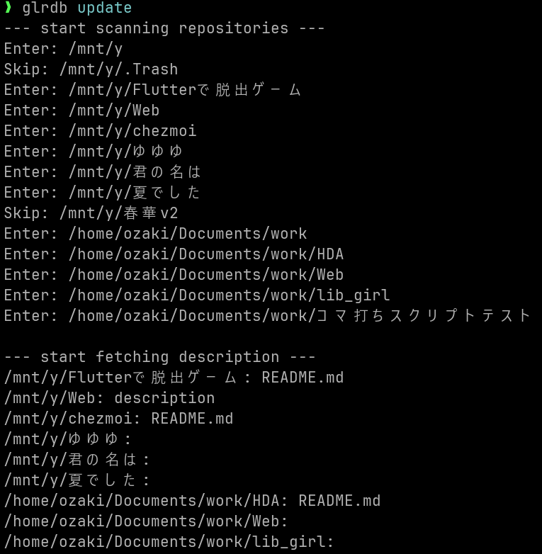
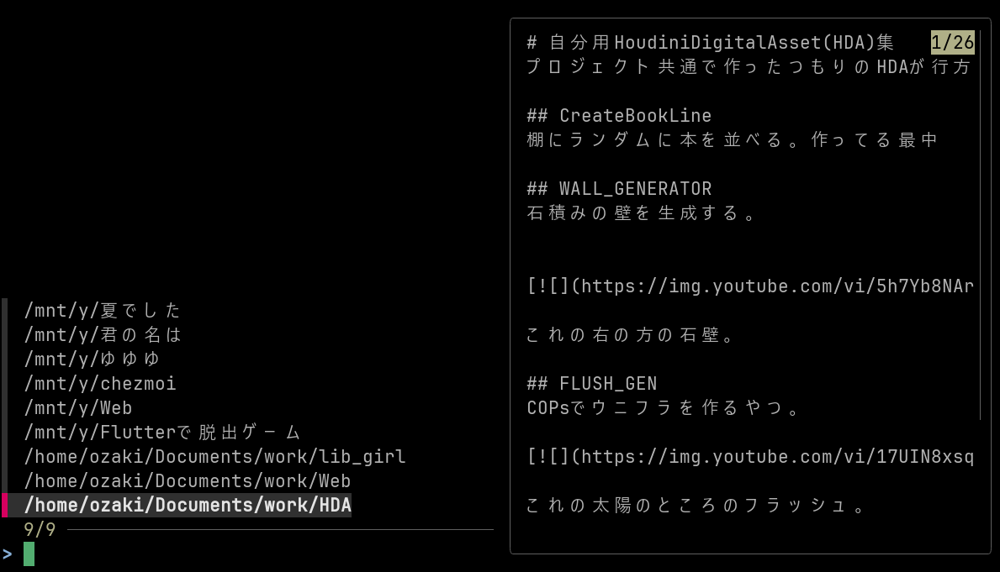
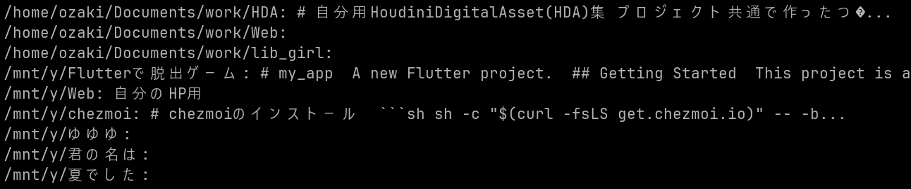

# ローカルに散らばった作り捨てリポジトリの一覧ツール

## 概要

NASとかローカルに散らばった作り捨てリポジトリの一覧を管理するためのツールです。

bareリポジトリを想定して作りましたが、普通のリポジトリも管理できるように拡張しました。もともとがbareリポジトリを想定していたためdescriptionが優先されますが、なければREADME(lowercase対応)の内容を保存するようにしました。

fzfが便利すぎてTUIを作るより連携させた方がいいと思ったので、printサブコマンドはfzf用のタブ区切りのリストを出力するようにしています。

が、もっと雑に見たいことの方が多いと思うのでlistサブコマンドで行単位で出すようにもしています。

今回作った目的はBoltDBを使って見たかったというのがあります。なのでboltbrowserでdbの中身を見たりできるのですが、残念ながら日本語の表示はおかしくなるようです。

## install

go installでインストールできます。

```bashbash
$ go install github.com/oja-bitterlife/glrdb/glrdb@latest
```

設定ファイルをコマンドを実行する場所で作成してください。

```bash
$ glrdb init > glrdb.toml
$ nano glrdb.toml
```

テンプレートが出力されるので必要なところを編集してください。とりあえずsourcesのpathを指定すれば動くと思います。

~/.config対応も考えましたが、たぶんこのコマンド自体使い捨てる気がするのでまぁ都度tomlを作って用が済んだら全部rmってもらえばいいかなって。


## 使い方

リポジトリが存在するであろうディレクトリの*親*をglrdb.tomlに追加しておきます。

ものぐさなので親指定でサブディレクトリに潜ってリポジトリを探しますが、直接リポジトリを指定することもできます。

```toml
# tomlでdb名とかmax_depthとか設定できます
# 何が設定できるかはinitサブコマンドの出力を参照してください
[global]
# 共通設定

[[sourdes]]
path = "/path/to/repo_parent1"

[[sourdes]]
path = "/path/to/repo_parent2"
# extrudeオプションを指定すると名前が一致したリポジトリを無視します
# source単位かglobalで設定できます
extrude = ["repo1", "repo2"]
```

updateサブコマンドでリポジトリの一覧を更新します

```bash
$ glrdb update
```


printサブコマンドでfzf用のタブ区切りのリストを出力します。

1列目がリポジトリ名、2列目がdescriptionかREADME.mdの内容をbase64エンコードしたものになります。

```bash
$ glrdb print | fzf --delimiter '\t' --with-nth 1 --preview 'echo {2} | base64 -d' | cut -f1
```


たいていはlistサブコマンドで事足りると思います。

```bash
$ glrdb list
```


